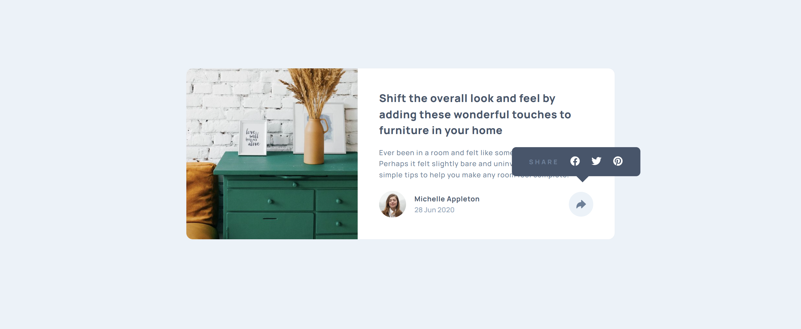
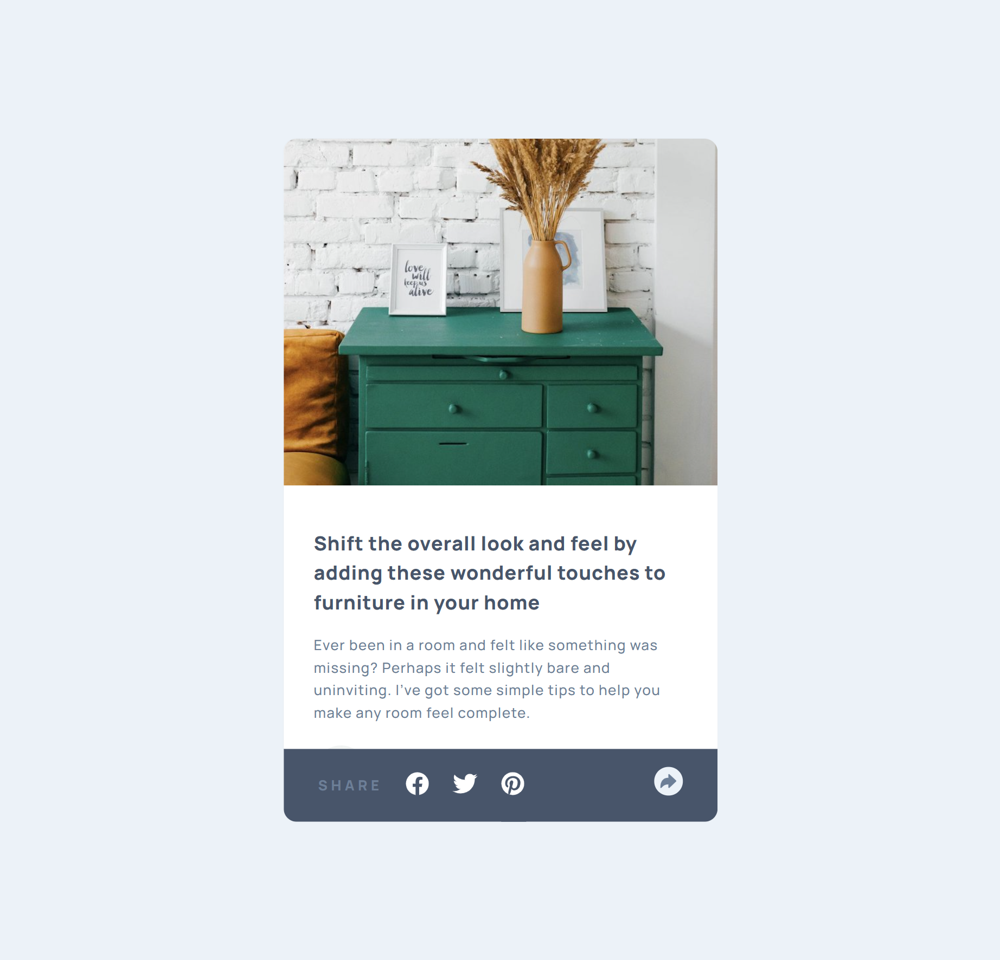
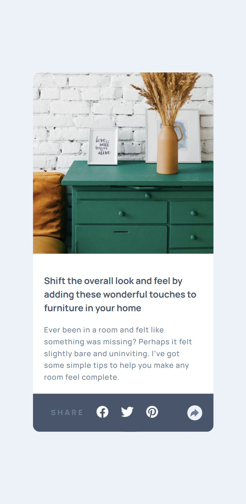

# Article Preview Component

A responsive article preview card component built with HTML, CSS, and vanilla JavaScript. This project features a modern card design with an interactive share button that adapts beautifully across all devices, demonstrating clean UI/UX principles and responsive design techniques.

## Preview

The component displays an elegant article card featuring:

- Featured article image with proper responsive handling
- Article headline and description
- Author profile with avatar, name, and publication date
- Interactive share button with social media links
- Smooth toggle animations for share functionality

### Desktop Preview



### Tablet Preview



### Mobile Preview



## Features

- 🎨 Clean, modern card-based design
- 📱 Fully responsive across multiple breakpoints
- 🔄 Interactive share button with toggle functionality
- 💫 Smooth CSS transitions and animations
- 🔤 Google Fonts integration (Manrope)
- ♿ Semantic HTML structure
- 🎯 Context-aware share UI (tooltip on desktop, footer bar on mobile)
- 📦 Lightweight vanilla JavaScript (no dependencies)
- 🖼️ Responsive image handling with CSS background
- 🎨 Ionicons integration for modern iconography

## Technologies Used

- HTML5
- CSS3 (Flexbox & Grid)
- Vanilla JavaScript (ES6+)
- Google Fonts (Manrope)
- Ionicons 7.1.0

## Project Structure

```
project-root/
│
├── index.html          # Main HTML file
├── style.css           # Stylesheet
├── script.js           # JavaScript functionality
├── README.md           # Project Documentation
└── Images/
    ├── drawers.jpg              # Featured article image
    ├── avatar-michelle.jpg      # Author profile photo
    └── screenshots/
        ├── desktop-preview.png  # Desktop screenshot
        ├── tablet-preview.png   # Tablet screenshot
        └── mobile-preview.png   # Mobile screenshot
```

## Installation

1. Clone or download this repository
2. Ensure all images are placed in the `Images` folder
3. Open `index.html` in your web browser

## Usage

The share button functionality works out of the box:

- **Desktop**: Click the share button to reveal a tooltip with social media icons
- **Mobile/Tablet**: Click to reveal a footer bar with social sharing options
- Click again to hide the share options

No additional configuration required!

## Design Specifications

### Colors

#### Background & Card

- **Page Background**: `hsl(210, 46%, 95%)` - Very light grayish blue
- **Card Background**: `hsl(0, 0%, 100%)` - White
- **Share Button**: `hsl(210, 46%, 95%)` - Light grayish blue
- **Share Button Active**: `hsl(217, 19%, 35%)` - Dark grayish blue
- **Share Tooltip/Footer**: `hsl(217, 19%, 35%)` - Dark grayish blue

#### Text Colors

- **Heading**: `hsl(217, 19%, 35%)` - Very dark grayish blue
- **Body Text**: `hsl(214, 17%, 51%)` - Desaturated dark blue
- **Author Name**: `hsl(217, 19%, 35%)` - Very dark grayish blue
- **Date**: `hsl(212, 23%, 69%)` - Grayish blue
- **Share Text**: `hsl(210, 46%, 95%)` - Light grayish blue

### Typography

- **Font Family**: Manrope (Google Fonts)
- **Base Font Size**: 13px
- **Article Title**: 16-20px, weight: 700
- **Description**: 13px, weight: 500, line-height: 1.5
- **Author Name**: 13px, weight: 700
- **Date**: 13px, weight: 500

### Layout

#### Desktop (>768px)

- **Card Layout**: Horizontal (image left, content right)
- **Max Width**: 730px
- **Image Width**: 285px
- **Content Padding**: 32px 40px
- **Share Button**: Tooltip/popover style

#### Tablet (≤768px)

- **Card Layout**: Vertical (image top, content bottom)
- **Max Width**: 500px
- **Image Height**: 200px
- **Content Padding**: 36px 32px
- **Share UI**: Footer bar style

#### Mobile (≤500px)

- **Card Layout**: Vertical (compact)
- **Max Width**: 327px
- **Image**: Square crop (327x200px)
- **Content Padding**: 36px 32px
- **Share UI**: Full-width footer bar

### Spacing & Dimensions

- **Card Border Radius**: 10px
- **Share Button Size**: 32px (circular)
- **Profile Avatar**: 40px (circular)
- **Card Shadow**: `0 40px 40px -10px rgba(201, 213, 225, 0.5)`

## JavaScript Functionality

### Share Button Toggle

```javascript
const btnEl = document.querySelector(".btn");
const shareEl = document.querySelector(".share-wrapper");

btnEl.addEventListener("click", () => {
  shareEl.classList.toggle("display--none");
  btnEl.classList.toggle("btn--clicked");
});
```

**Features:**

- Simple toggle mechanism
- Class-based state management
- No external dependencies
- Cross-browser compatible

## Responsive Breakpoints

The component uses two main breakpoints:

1. **Desktop**: Above 768px - Horizontal card with tooltip
2. **Tablet**: 500px - 768px - Vertical card with footer
3. **Mobile**: Below 500px - Compact vertical card

## Customization

You can easily customize the component by modifying values in `style.css`:

- Change colors by updating HSL values
- Adjust card dimensions by modifying width and padding values
- Update breakpoints in media queries for different responsive behavior
- Modify typography by changing font sizes and weights
- Customize transitions and animations
- Change icon styles via Ionicons classes

## Browser Support

This component works on all modern browsers:

- Chrome (latest)
- Firefox (latest)
- Safari (latest)
- Edge (latest)
- Opera (latest)

**Note**: Uses CSS Grid and Flexbox. IE11 not supported.

## Accessibility Features

- Semantic HTML with `<article>` element
- Proper heading hierarchy
- Alt text for images
- Interactive elements are keyboard accessible
- Sufficient color contrast for readability
- Focus states on interactive elements

## Key CSS Techniques Used

- **Flexbox**: Card layout and content alignment
- **CSS Grid**: Profile section layout
- **Background Images**: Hero image handling with `background-size: cover`
- **CSS Transitions**: Smooth hover and click effects
- **Media Queries**: Responsive breakpoints
- **Positioning**: Share tooltip/popover placement
- **Transform**: Button active states
- **Box Shadow**: Card depth and elevation

## Key JavaScript Features

- **Event Listeners**: Click handler for share button
- **DOM Manipulation**: Toggle classes for show/hide functionality
- **ES6 Syntax**: Modern JavaScript conventions
- **Lightweight**: No frameworks or libraries required

## Icons

This project uses **Ionicons 7.1.0** for all icons:

- `arrow-redo` - Share button icon
- `logo-facebook` - Facebook social icon
- `logo-twitter` - Twitter social icon
- `logo-pinterest` - Pinterest social icon

Loaded via CDN with ESM and fallback support.

## Credits

This project is a solution for a Frontend Mentor challenge, designed to help improve front-end coding skills through practical component development with interactive JavaScript functionality.

## Future Enhancements

- [ ] Add CSS variables for easier theming
- [ ] Implement actual social sharing functionality
- [ ] Add animations when share options appear
- [ ] Include copy-to-clipboard feature
- [ ] Add dark mode support
- [ ] Implement keyboard navigation for share options
- [ ] Add ARIA labels for better accessibility
- [ ] Include loading states for images

## License

This project is open source and available for personal and educational use.

---

**Built with ❤️ using HTML, CSS, Vanilla JavaScript, and attention to responsive design**
